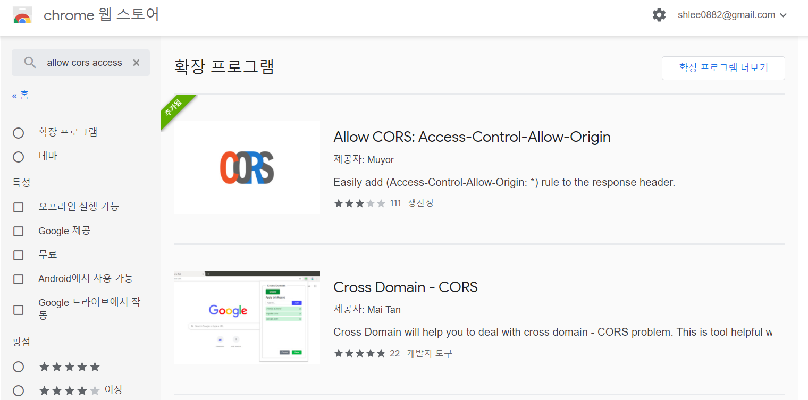

## 개요

NodeJs와 VueJs를 이용해 웹서버를 띄우고
구글 API와 구글 검색엔진 API KEY를 사용해
입력한 키워드에 대한 이미지를 검색해 
크롤링하는 토이 프로젝트입니다.
<br>

## 사용방법

- 검색하고 싶은 키워드를 입력합니다.
- 키워드에 대한 이미지를 구글 검색엔진을 통해 받아옵니다.
- 이미지를 모두 모은 결과값을 압축파일 zip로 받아옵니다.
- 이미지는 최대 200개 까지 받아올 수 있습니다.
- ⚠️**Chrome Extension**에서 🔴**Access-Control-Allow-Origin** 플러그인을 다운받아 사용하면 
효율적으로 크롤링 할 수 있습니다.


<br>

## 배포된 Deploy URL

https://shlee0882.github.io/vuejs-nodejs-google-image-crawling/

<br>

## 설치방법 공유

- TODO 추후 블로깅 예정...

<br>

## 오픈 API 사용

 npm을 사용하여 필요한 오픈API를 설치 및 사용 

- url, request, jquery, axios
- fs
- google-images
- jszip, jszip-utils


<br>

## 코드 설명 

- TODO 추후 블로깅 예정...

<br>

## 실행하기
```
npm install
npm run serve
```

## GitHub Pages 배포하기

1. gh-pages 설치하기

```
npm install --save gh-pages
```

2. package.json에 추가하기

```
"homepage": "https://shlee0882.github.io/vuejs-nodejs-google-image-crawling/"


"scripts": {
    "predeploy": "npm run build",
    "deploy": "gh-pages -d dist"
}
```

3. 배포하기
```
npm run deploy
```

4. 배포된 URL 확인하기

```
https://shlee0882.github.io/vuejs-nodejs-google-image-crawling/
```

<br>

## 레퍼런스

- https://github.com/vadimdemedes/google-images
- https://cli.vuejs.org/config/
